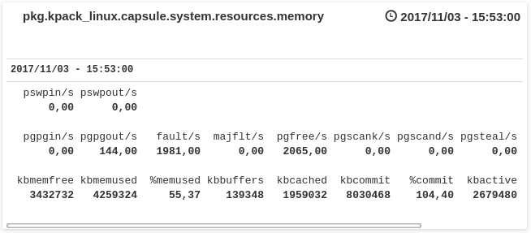

kpack_linux
-----------

[]()

kpack_linux is a [komlogd](<https://github.com/komlog-io/komlogd>) package
for monitoring and visualizing linux servers metrics.

The methodology we want to implement here is the [USE Method](<http://www.brendangregg.com/usemethod.html>), summarized
this way by its author, Brendan Gregg:

> *For every resource, check utilization, saturation, errors.*

Right now, kpack_linux checks resourse utilization and saturation, checking for anomalies automatically.

The purpose of this package is to automate, as much as possible, the analysis of linux servers.


## 1. Install

> **IMPORTANT**: kpack_linux checks metrics using **sysstat** package utilities. Install it with your distribution's package manager.

To add *kpack_linux* package to komlogd, just edit your komlogd configuration file (*komlogd.yaml*)
and add a *package block* like this one:

```
- package:
    install: https://github.com/komlog-io/kpack_linux/archive/master.zip
    enabled: yes
    venv: default
```

Then, reboot your komlogd agent.

## 2. Package Functionality

kpack_linux will store data for your linux server at uri *pkg.kpack_linux.<server-name>*
Under this uri, different resource uris will be created storing utilization and saturation metrics:

- *resources.cpu*:


- *resources.memory*:



- *resources.storage*:


- *resources.network*:


## 3. Package customization

You can modify the base uri or the update frecuency in
[settings.py file](/kpack_linux/settings.py). Feel free to fork this repo
and adjust them to your needs.


# Contributing and Help

Feel free to fork this repo and make your pull requests. **Thank you** for your time.
If you need help, please visit our IRC Channel #Komlog (Freenode) or our
[mailing lists](https://groups.google.com/forum/#!forum/komlog).

