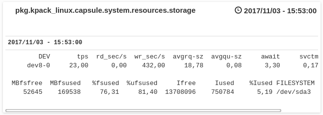

kpack_linux
-----------

[]()

kpack_linux is a [komlogd](<https://github.com/komlog-io/komlogd>) package
for monitoring and visualizing linux servers metrics.

The methodology we want to implement here is the [USE Method](<http://www.brendangregg.com/usemethod.html>), summarized
this way by its author, Brendan Gregg:

> *For every resource, check utilization, saturation, errors.*

Right now, kpack_linux checks resourse utilization and saturation, checking for anomalies automatically.

The purpose of this package is to automate, as much as possible, the analysis of linux servers.


## 1. Install

> **IMPORTANT**: kpack_linux checks metrics using **sysstat** package utilities. Install it with your distribution's package manager.

To add *kpack_linux* package to komlogd, just edit your komlogd configuration file (*komlogd.yaml*)
and add a *package block* like this one:

```
- package:
    install: https://github.com/komlog-io/kpack_linux/archive/master.zip
    enabled: yes
    venv: default
```

Then, reboot your komlogd agent.

## 2. Package Functionality

kpack_linux will store data for your linux server at uri *pkg.kpack_linux.<server-name>*
Under this uri, different resource uris will be created storing utilization and saturation metrics:

- *resources.cpu*:


- *resources.memory*:


- *resources.storage*:



- *resources.network*:


## 3. Package customization

By default kpack_linux will extract information from the host running komlogd agent, and will
send it to Komlog every minute. However, you can modify this behaviour, based on your needs, as
we explain here.

The best way to customize kpack_linux package to your needs is **forking it and modifying your
fork files.**

### 3.1 Modifying the metrics update frecuency


Metrics update frecuency is controlled by variable SCHED in [*settings.py*](/kpack_linux/settings.py) file. The value of this
variable is a CronSchedule object. This object tells komlogd when to execute the function that
extracts information from your host. CronSchedule class uses the same format as classic Unix cron
to set execution interval, ie. to set a frecuency of execution of 5 minutes, you can set SCHED to:

```
SCHED = CronSchedule(minute='*/5')
```

### 3.2 Setting your host uri

By default, kpack_linux will store your information in uri *pkg.kpack_linux.<HOSTNAME>*.
This uri is controlled with var *BASE_URI* in [*settings.py*](/kpack_linux/settings.py) file. The value of this variable will
be passed as *base_uri* argument when creating your LinuxHost object in [*load.py*](/kpack_linux/load.py) file.

You can modify the value of *BASE_URI* to adapt it to your needs, but remember the value must
be a valid *uri*, ie. only use [0-9a-zA-z] characters or puntuation characters like dots, hyphens or underscores.

### 3.3 Monitoring remote hosts through SSH

kpack_linux allows you to monitor remote hosts through ssh. To do it, just edit *load.py* file
and create as many LinuxHost objects as hosts you want to monitor, and pass them the *ssh_cmd* 
parameter it should use to access them through ssh. You can see an example here:

```python

# Create a LinuxHost object per host we will monitor

host1 = LinuxHost(base_uri='pkg.kpack_linux.host1', ssh_cmd='ssh user@host1')
host2 = LinuxHost(base_uri='pkg.kpack_linux.host2', ssh_cmd='ssh user@host2')
host3 = LinuxHost(base_uri='pkg.kpack_linux.host3', ssh_cmd='ssh user@host3')

# start monitoring them

asyncio.ensure_future(host1.load())
asyncio.ensure_future(host2.load())
asyncio.ensure_future(host3.load())

```

# Contributing and Help

Feel free to fork this repo and make your pull requests. **Thank you** for your time.
If you need help, please visit our IRC Channel #Komlog (Freenode) or our
[mailing lists](https://groups.google.com/forum/#!forum/komlog).

